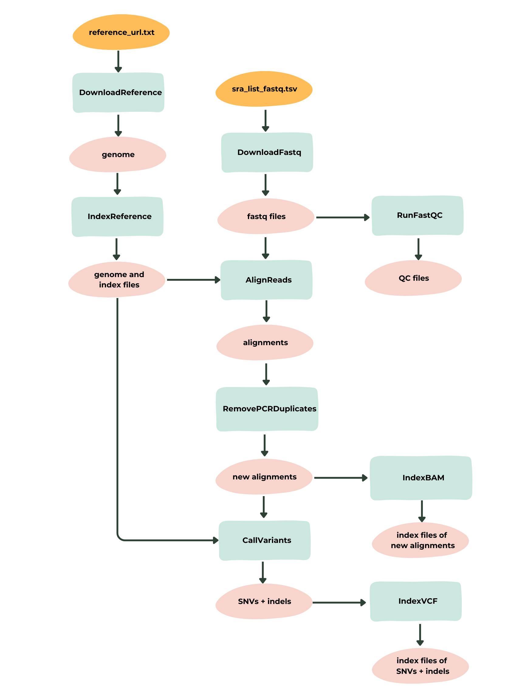
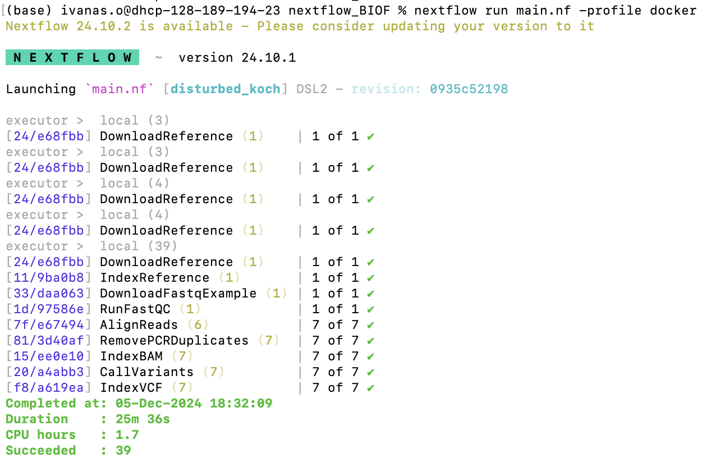
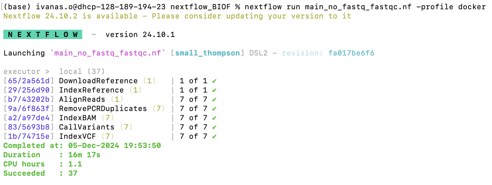

# SNVcalling_Nextflow

This Nextflow pipeline identifies single nucleotide variants (SNVs) and indels from paired-end FASTQ files of an organism of interest.

## Table of Contents
- [Introduction](#introduction)
- [Workflow Overview](#workflow-overview)
- [Requirements](#requirements)
- [Installation](#installation)
- [Repository Structure](#repository-structure)
- [Data](#data)
  - [Input](##input)
  - [Output](##output)
  - [Example Datasets](#example-datasets)
  - [Questions](##questions)
- [Running the pipeline](#running-the-pipeline)
- [Customize Pipeline](#customize-pipeline)
- [Comments](#comments)
- [References](#references)

# Introduction

Genomic variants are classified into three main categories based on size: single nucleotide variants (SNVs), 
short insertions and deletions (indels) of less than 50 base pairs (bp), and structural variants (SVs) of 50 bp or more. 
These variants can be detected in a high-throughput manner using whole-genome
sequencing (WGS) data consisting of 100–300 bp short reads.
Accurate and efficient detection of these variants is critical for a wide range of genetic, 
clinical, and evolutionary studies [1].

Short-read sequencing for variant detection are popular, 
particularly in multi-sample analyses, due to its lower cost and reduced requirements for DNA quality and quantity 
compared to long-read sequencing technologies [1]. 
Despite its limitations, short-read data has proven to be effective for identifying SNVs and indels with high reliability [2].

BCFtools is a powerful suite of utilities designed to handle variant calling and manipulate Variant Call Format (VCF) 
and Binary Call Format (BCF) files. 
It offers functionalities for variant calling, 
filtering, and format conversion, making it a valuable tool in genomic analyses [2, 5-6].

The workflow employs BWA for indexing the reference genome and performing sequence alignment [3], 
SAMtools for managing alignment files and removing PCR duplicates [4], 
and BCFtools for variant calling. Together, these tools create a streamlined and scalable system 
for efficient identification of SNVs and indels with minimal user intervention.

# Workflow Overview

The workflow includes the following steps:
* Downloads the reference genome.
* Indexes the reference genome with BWA.
* Downloads short-read paired sequence data with fastq-dump and compressed the files.
* Obtains quality control metrics with FastQC for all paired FASTQ files.
* Aligns paired sequence data to the reference genome with BWA.
* Converts alignments to compressed format and removes PCR duplicates (`.bam`) with samtools.
* Generates index files with samtools of alignment data without PCR duplicates for IGV visualization. 
* Identifies SNVs and indels with BCFtools from the processed alignment data without PCR duplicates. 
* Creates index files with BCFtools of SNVs and indels files for IGV visualization. 

Workflow Diagram



# Requirements

The software dependencies in order to run this pipeline are the following:

```bash
# GNU Bash
bash 3.2.57

# OpenJDK (Java Runtime Environment)
openjdk 21.0.5

# Docker
Docker 27.2.0

# Nextflow
nextflow 24.10.1

# Git
git 2.15.0
```

The pipeline includes a "docker" profile that uses public Docker images, most of which are from **BioContainers**. A list of the Docker images used can be found in the [Nextflow configuration file](config/nextflow.config).

By default, no specific resource limits are assigned to Docker containers. This means they can use all available memory on the host system unless specific limits are set.

If you want to adjust the resource allocations for this pipeline, refer to the [Customize Pipeline](#customize-pipeline) section.


# Installation
Open your terminal and placed yourself in the directory where you want to save this github repository.
Now clone the this github repository:

```bash
git clone https://github.com/Amisor/SNVcalling_Nextflow.git
```
Change your working directory to the GitHub repository with the following command:

```bash
cd SNVcalling_Nextflow
```
# Repository Structure

### Repository Structure

When you clone the GitHub repository, you’ll have the following directories and files:

* `data`: Contains pre-downloaded FASTQ files and FastQC results.
(This directory could also be empty if the user decides to download the FASTQ files and generate FastQC results using the pipeline). 
All files created by the pipeline will be stored here in their respective subdirectories.
* `images`: Contains images related to the project, including the workflow diagram and runtimefor the different main files.
* `modules`: Stores the different processes used in the pipeline.
* `main.nf`: The main pipeline file responsible for running all processes, including `DownloadFastq` (modified for providing a downloading example) and `RunFastQC` (to generate FastQC results for a single FASTQ file as an example). 
See [Questions](#questions) for further details.
* `main_no_fastq_fastqc.nf`: An alternative main pipeline file that excludes the `DownloadFastq` and `RunFastQC` processes. 
It assumes all the desired FASTQ files are prestored in the `data` directory. This version is optimized for faster runtime and allows users to 
test the pipeline in less time.

- `nextflow.config`: The Nextflow configuration file specifying local resources, Docker resources, and Docker images for each process.

```plaintext
SNVcalling_Nextflow/
├── data/
|   ├── [some directories and files]
├── images/
|   ├── [some files]
├── modules/
|   ├── [some directories and files]
├── main.nf
├── main_no_fastq_fastqc.nf
├── nextflow.config
```

Runtime of main.nf is approx 25 min.


Runtime of main_no_fastq_fastqc.nf is approx 16 min



# Data
This section specifies the required input files and the expected output files for running the Nextflow pipeline.

## Input

All input files must be saved in the [data](data) directory.

- `reference_url.txt`: a text file containing the URL to download the reference genome.
- `sra_list_fastq.tsv`: A TSV file containing two columns:
  - **region**: The name of the regions, formatted without underscores or spaces.
  - **sra_num**: The SRA accession numbers for downloading the FASTQ files.

If the user does not wish to download the FASTQ files, only the `reference_url.txt` is required. 
However, the alignment process relies on the assumption that the FASTQ file names are renamed during 
the downloading process (`DownloadFastq`) based on the TSV file, associating each region with 
its corresponding paired FASTQ files. Refer to [Customize Pipeline](#customize-pipeline) 
for details about running the pipeline without downloading the FASTQ files.

## Output 
The output files include:

- **Reference genome and its index files** (`.fna, ): Stored in the [Reference_Genome](data/Reference_Genome) directory.
- **Downloaded FASTQ Files**: Stored in the [FASTQ](data/FASTQ) directory.
- **FastQC Analysis**: Quality control reports for FASTQ files are available in [FastQC](data/FastQC).
- **Alignment Files**: Alignment `.sam` files stored in [Alignment](data/Alignment).
- **BAM Files**: Processed alignment files to remove PCR duplicates and generate the final BAM files.
Aligned FASTQ files to the reference genome, with PCR duplicates removed (`.bam`), are stored in the [BAM](data/BAM) directory.
- **SNVs and Indels**: Final variant call files (`.vcf.gz`) are stored in the [SNV](data/SNV) directory.
_ ****
## Example Datasets 

For this project, *Drosophila melanogaster* (fruit fly) data was used for testing. 
The goal is to provide a pipeline to identify the genetic diversity within Drosophila melanogaster populations from different regions: North America, South America, Africa, Asia, Oceania, and Europe.

The datasets were carefully selected from the NCBI SRA database to ensure comparability. 
All samples consist of short-read paired-end sequences from Drosophila melanogaster in the adult stage. Sequencing was performed using the Illumina platform.
If detailed information about the data is available, such as the specific country, it is stored in the region variable. However, if the data lacks such granularity, only the continent is stored.

Unfortunately, no short-read sequencing genomes generated on the Illumina platform were found for South America. 
The majority of datasets from this region were produced using long-read sequencing technologies, 
such as Peru (SRR7816670). One dataset from Chile (SRR21942766) was generated using the Illumina HiSeq 2500, 
but it is based on ATAC-seq rather than WGS, making it unsuitable for single nucleotide variant (SNV) calling.
ATAC-seq focuses on open chromatin regions, and while it may detect some SNV in these areas, 
the data is inherently biased and lacks comprehensive genome coverage. 
In contrast, WGS provides complete coverage of the genome, including both coding and non-coding regions, 
ensuring accurate detection of SNVs across the entire genome.

Table 1: Overview of datasets used in the pipeline, including region, sequencing details, and biosamples.

| Region          | SRA Accession Number | # of Spots   | # of Bases | Size | Published   | Instrument           | Strategy | Layout  | Development Stage | Biosample       |
|------------------|----------------------|--------------|------------|------|-------------|----------------------|----------|---------|-------------------|-----------------|
| USA             | SRR30674540          | 33,246,271   | 5G         | 3.1Gb| 2024-09-17  | Illumina HiSeq 2000 | WGS      | Paired  | adult             | SAMN43783121    |
| Australia       | SRR17978916          | 21,518,768   | 6.5G       | 1.9Gb| 2022-02-10  | Illumina NovaSeq 6000| WGS      | Paired  | adult             | SAMN25851855    |
| Russia          | SRR26549080          | 17,167,488   | 5.1G       | 2.3Gb| 2024-09-14  | Illumina HiSeq 2500 | WGS      | Paired  | adult             | SAMN37946768    |
| China           | SRR23103754          | 19,292,824   | 5.8G       | 1.7Gb| 2024-04-30  | Illumina NovaSeq 6000| WGS      | Paired  | adult             | SAMN32772670    |
| Spain           | SRR24223130          | 30,664,281   | 9G         | 2.8Gb| 2024-08-31  | Illumina NovaSeq 6000| WGS      | Paired  | adult             | SAMN34257693    |
| Central Africa  | SRR21854039          | 46,871,379   | 11.7G      | 4.4Gb| 2022-10-12  | Illumina HiSeq 4000 | WGS      | Paired  | adult             | SAMN30837313    |
| West Africa     | ERR9463903           | 35,724,955   | 10.3G      | 3.2Gb| 2024-07-29  | Illumina NovaSeq 6000| WGS      | Paired  | adult             | SAMEA13793122   |

The reader will notice that the size of each original FASTQ file is quite large. 
To test the pipeline efficiently, I downloaded each FASTQ file and created smaller test files by extracting only the first 40,000 lines 
from each paired FASTQ file for every region. This results in 10,000 sequences per file 
(since a FASTQ file consists of 4 lines per sequence).

The code to generate these smaller FASTQ files is not part of the pipeline; 
it was executed separately to prepare the desired test files.

An example of this process for the Australia dataset is provided below:

```bash
region="Australia"
sra_num="SRR17978916"

# Download the FASTQ files using fastq-dump
fasterq-dump ${sra_num}

# Obtain the first 10,000 sequences (40,000 lines) from the first FASTQ file
head -n 40000 ${sra_num}_1.fastq > ${region}_${sra_num}_1.fastq
gzip ${region}_${sra_num}_1.fastq

# Obtain the first 10,000 sequences (40,000 lines) from the second FASTQ file
head -n 40000 ${sra_num}_2.fastq > ${region}_${sra_num}_2.fastq
gzip ${region}_${sra_num}_2.fastq
```
This will produce `${region}_${sra_num}_1.fastq.gz` and `${region}_${sra_num}_2.fastq.gz`.

The reader may have the following questions:

## Questions

**Can I use the pipeline with downloading or without downloading the FASTQ files?**

Yes. The pipeline originally is designed to download the FASTQ files. However,
you can download the fastq files and placed them inside the [FASTQ](data/FASTQ) directory .
They automatically will be used as an input for subsequent processes, refer to [Customize Pipeline](#customize-pipeline) 
for details.

**How can I test the DownloadFastq process of the pipeline?**

Because the original FASTQ files are large, I added a `sra_list_fastq_example.tsv` file inside the [data](data) directory 
for downloading smaller FASTQ files from an example region with their respective SRA accession numbers. 
This is done through the `DownloadFastqExample` process instead of the `DownloadFastq` process. 
The `DownloadFastq` process saves the files inside the [FASTQ](data/FASTQ) directory, which are then used for subsequent processes. 
In contrast, `DownloadFastqExample` uses the same script as `DownloadFastq` but does not publish the results in the FASTQ directory, 
preventing the example FASTQ files from being used in the next processes. 

This approach avoids biological nonsense, as the example data is from the *Bordetella hinzii* bacterium. 
While these smaller files have a better download runtime when running the pipeline with docker, they are not suitable for alignment 
to the *Drosophila melanogaster* reference genome and would unnecessarily consume memory.

The user can modify the `main.nf` file to enable the original `DownloadFastq` process. 
However, be aware that this requires sufficient memory capacity. 
Furthermore, Docker images don't not handle downloading such large files. 
The user can modify the resources allocated to the pipeline, whether running locally or with Docker, 
in the `nextflow.config` file. For more details, see [Customize Pipeline](#customize-pipeline).

**Does the pipeline obtain FastQC files?**

Yes, the pipeline generates FastQC files for all regions. 
However, running this step with Docker can take a significant amount of time. 
To address this, a directory called `FASTQFastQCExample` was created to store only one FASTQ file 
(`Australia_SRR17978916_1.fastq.gz`) and run the `RunFastQc` process exclusively for that file. 
The results are added to the [FastQC](data/FastQC) directory.

For more details, refer to [Running the Pipeline](#running-the-pipeline).


# Running the pipeline

Let's zoom in into the data directory. Noticed that the only FastQC missing file correspond to 
`Australia_SRR17978916_1.fastq.gz` since `main.nf` gets its QC analysis for providing an example of the 
`RunFastQC` process.

```plaintext
data/
├── Alignment/
│   └── README.md
├── BAM/
│   └── README.md
├── FASTQ/
│   ├── Australia_SRR17978916_1.fastq.gz
│   ├── Australia_SRR17978916_2.fastq.gz
│   ├── CentralAfrica_SRR21854039_1.fastq.gz
│   ├── CentralAfrica_SRR21854039_2.fastq.gz
│   ├── China_SRR23103754_1.fastq.gz
│   ├── China_SRR23103754_2.fastq.gz
│   ├── Russia_SRR26549080_1.fastq.gz
│   ├── Russia_SRR26549080_2.fastq.gz
│   ├── Spain_SRR24223130_1.fastq.gz
│   ├── Spain_SRR24223130_2.fastq.gz
│   ├── USA_SRR30674540_1.fastq.gz
│   ├── USA_SRR30674540_2.fastq.gz
│   ├── WestAfrica_ERR9463903_1.fastq.gz
│   └── WestAfrica_ERR9463903_2.fastq.gz
├── FastQC/
│   ├── Australia_SRR17978916_2_fastqc.html
│   ├── Australia_SRR17978916_2_fastqc.zip
│   ├── CentralAfrica_SRR21854039_1_fastqc.html
│   ├── CentralAfrica_SRR21854039_1_fastqc.zip
│   ├── CentralAfrica_SRR21854039_2_fastqc.html
│   ├── CentralAfrica_SRR21854039_2_fastqc.zip
│   ├── China_SRR23103754_1_fastqc.html
│   ├── China_SRR23103754_1_fastqc.zip
│   ├── China_SRR23103754_2_fastqc.html
│   ├── China_SRR23103754_2_fastqc.zip
│   ├── Russia_SRR26549080_1_fastqc.html
│   ├── Russia_SRR26549080_1_fastqc.zip
│   ├── Russia_SRR26549080_2_fastqc.html
│   ├── Russia_SRR26549080_2_fastqc.zip
│   ├── Spain_SRR24223130_1_fastqc.html
│   ├── Spain_SRR24223130_1_fastqc.zip
│   ├── Spain_SRR24223130_2_fastqc.html
│   ├── Spain_SRR24223130_2_fastqc.zip
│   ├── USA_SRR30674540_1_fastqc.html
│   ├── USA_SRR30674540_1_fastqc.zip
│   ├── USA_SRR30674540_2_fastqc.html
│   ├── USA_SRR30674540_2_fastqc.zip
│   ├── WestAfrica_ERR9463903_1_fastqc.html
│   ├── WestAfrica_ERR9463903_1_fastqc.zip
│   ├── WestAfrica_ERR9463903_2_fastqc.html
│   ├── WestAfrica_ERR9463903_2_fastqc.zip
├── FASTQFastQCExample
│   ├── Australia_SRR17978916_1.fastq.gz
│   └── README.md
├── IndexBAM/
│   └── README.md
├── IndexVCF/
│   └── README.md
├── ReferenceGenome/
│   └── README.md
├── SNV/
│   └── README.md
├── reference_url.txt
├── sra_list_fastq_example.tsv
├── sra_list_fastq.tsv
```
You can run both main files `main.nf` and `main_no_fastq_fastqc.nf` with or without docker. 
The instructions are provided below: 

```bash
# Run main without Docker
nextflow run main.nf

# Run main with Docker
nextflow run main.nf -profile docker

# Run main_no_fastq_fastqc without Docker
nextflow run main_no_fastq_fastqc.nf

# Run main_no_fastq_fastqc with Docker
nextflow run main_no_fastq_fastqc.nf -profile docker
```

Remember: 
**Run main_no_fastq_fastqc.nf with docker profile for testing the repository with Docker in less than 20 min.**


The updated `data` directory after running `main.nf` is provided below. 
All new files are enclosed in double asterisks (**) for clarity. 
If you run `main_no_fastq_fastqc.nf`, the resulting `data` directory will be the same, 
except for the missing files Australia_SRR17978916_1_fastqc.html and Australia_SRR17978916_1_fastqc.zip, 
as the `RunFastQC` process is not tested in this configuration.

```plaintext
data/
├── Alignment/
│   ├── **aligned_Australia.sam**
│   ├── **aligned_CentralAfrica.sam**
│   ├── **aligned_China.sam**
│   ├── **aligned_Russia.sam**
│   ├── **aligned_Spain.sam**
│   ├── **aligned_USA.sam**
│   ├── **aligned_WestAfrica.sam**
│   └── README.md
├── BAM/
│   ├── **aligned_Australia_final.bam**
│   ├── **aligned_CentralAfrica_final.bam**
│   ├── **aligned_China_final.bam**
│   ├── **aligned_Russia_final.bam**
│   ├── **aligned_Spain_final.bam**
│   ├── **aligned_USA_final.bam**
│   ├── **aligned_WestAfrica_final.bam**
│   └── README.md
├── FASTQ/
│   ├── Australia_SRR17978916_1.fastq.gz
│   ├── Australia_SRR17978916_2.fastq.gz
│   ├── CentralAfrica_SRR21854039_1.fastq.gz
│   ├── CentralAfrica_SRR21854039_2.fastq.gz
│   ├── China_SRR23103754_1.fastq.gz
│   ├── China_SRR23103754_2.fastq.gz
│   ├── Russia_SRR26549080_1.fastq.gz
│   ├── Russia_SRR26549080_2.fastq.gz
│   ├── Spain_SRR24223130_1.fastq.gz
│   ├── Spain_SRR24223130_2.fastq.gz
│   ├── USA_SRR30674540_1.fastq.gz
│   ├── USA_SRR30674540_2.fastq.gz
│   ├── WestAfrica_ERR9463903_1.fastq.gz
│   ├── WestAfrica_ERR9463903_2.fastq.gz
│   └── README.md
├── FastQC/
│   ├── **Australia_SRR17978916_1_fastqc.html**
│   ├── **Australia_SRR17978916_1_fastqc.zip**
│   ├── Australia_SRR17978916_2_fastqc.html
│   ├── Australia_SRR17978916_2_fastqc.zip
│   ├── CentralAfrica_SRR21854039_1_fastqc.html
│   ├── CentralAfrica_SRR21854039_1_fastqc.zip
│   ├── CentralAfrica_SRR21854039_2_fastqc.html
│   ├── CentralAfrica_SRR21854039_2_fastqc.zip
│   ├── China_SRR23103754_1_fastqc.html
│   ├── China_SRR23103754_1_fastqc.zip
│   ├── China_SRR23103754_2_fastqc.html
│   ├── China_SRR23103754_2_fastqc.zip
│   ├── Russia_SRR26549080_1_fastqc.html
│   ├── Russia_SRR26549080_1_fastqc.zip
│   ├── Russia_SRR26549080_2_fastqc.html
│   ├── Russia_SRR26549080_2_fastqc.zip
│   ├── Spain_SRR24223130_1_fastqc.html
│   ├── Spain_SRR24223130_1_fastqc.zip
│   ├── Spain_SRR24223130_2_fastqc.html
│   ├── Spain_SRR24223130_2_fastqc.zip
│   ├── USA_SRR30674540_1_fastqc.html
│   ├── USA_SRR30674540_1_fastqc.zip
│   ├── USA_SRR30674540_2_fastqc.html
│   ├── USA_SRR30674540_2_fastqc.zip
│   ├── WestAfrica_ERR9463903_1_fastqc.html
│   ├── WestAfrica_ERR9463903_1_fastqc.zip
│   ├── WestAfrica_ERR9463903_2_fastqc.html
│   ├── WestAfrica_ERR9463903_2_fastqc.zip
│   └── README.md
├── FASTQFastQCExample
│   ├── Australia_SRR17978916_1.fastq.gz
│   └── README.md
├── IndexBAM/
│   ├── **aligned_Australia_final.bam.bai**
│   ├── **aligned_CentralAfrica_final.bam.bai**
│   ├── **aligned_China_final.bam.bai**
│   ├── **aligned_Russia_final.bam.bai**
│   ├── **aligned_Spain_final.bam.bai**
│   ├── **aligned_USA_final.bam.bai**
│   ├── **aligned_WestAfrica_final.bam.bai**
│   └── README.md
├── IndexVCF/
│   ├── **Australia.vcf.gz.tbi**
│   ├── **CentralAfrica.vcf.gz.tbi**
│   ├── **China.vcf.gz.tbi**
│   ├── **Russia.vcf.gz.tbi**
│   ├── **Spain.vcf.gz.tbi**
│   ├── **USA.vcf.gz.tbi**
│   ├── **WestAfrica.vcf.gz.tbi**
│   └── README.md
├── ReferenceGenome/
│   ├── **reference_genome.fna**
│   ├── **reference_genome.fna.amb**
│   ├── **reference_genome.fna.ann**
│   ├── **reference_genome.fna.bwt**
│   ├── **reference_genome.fna.pac**
│   ├── **reference_genome.fna.sa**
│   └── README.md
├── SNV/
│   ├── **Australia.vcf.gz**
│   ├── **CentralAfrica.vcf.gz**
│   ├── **China.vcf.gz**
│   ├── **Russia.vcf.gz**
│   ├── **Spain.vcf.gz**
│   ├── **USA.vcf.gz**
│   ├── **WestAfrica.vcf.gz**
│   └── README.md
├── reference_url.txt
├── sra_list_fastq_example.tsv
├── sra_list_fastq.tsv
```

# Results and Visualization

To visualize the results in IGV, you will need the following files:
- The unzipped reference genome (`.fna`).
- Aligned BAM files for each region (`aligned_region_final.bam`) and their index files (`.bam.bai`).
- The SNV and indel files (`.vcf.gz`) and their index files (`.vcf.gz.tbi`).

**Are you new to IGV?** 

Install the Integrative Genomics Viewer (IGV) from the [IGV website](https://software.broadinstitute.org/software/igv/).

Open IGV and select the genome dropdown menu. Choose "Load Genome from File" and navigate to your `.fna` file.
Drag and drop or use "File > Load from File" to load your `aligned_region_final.bam` files along with their `.bam.bai` index files.
Similarly, load your `.vcf.gz` files along with their `.vcf.gz.tbi` index files.
Use the search bar in IGV to navigate to specific regions of interest and examine alignments, SNVs, and indels.

For more detailed instructions, refer to the [IGV User Guide](https://software.broadinstitute.org/software/igv/UserGuide).

# Customize Pipeline

## Resources
The user can modify the default CPU and memory limits for Docker in all processes by adding specific requirements. This can be achieved by
editing the Nextflow configuration file (`nextflow.config`) by setting the limits inside (or outside for running wihout docker) the Docker profile.

For example, if the user wants to limit CPUs and memory for the `RunFastQC` process, the following lines must be added to the `nextflow.config` file inside the Docker profile under the name of the process:

```groovy
process {
    withName: 'RunFastQC' {
        cpus = 2
        memory = '4 GB'
    }
}
```

## Output directory and input files

The user can also modify the outDir parameter in the configuration file to specify a custom output directory 
for storing pipeline files. Additionally, the location and names of input files can be changed in the configuration 
file as needed.

To make these changes:

*Open the nextflow.config file.
*Adjust the outDir parameter to the desired output directory.
*Update paths or names for input files under the relevant sections.

## Not Downloading FASTQ Files

If the user wants to provide their own FASTQ files, ensure they are saved in the [FASTQ](data/FASTQ) directory.
If you do not want to run the `RunFastQC` process to obtain quality control (QC) analyses, 
simply execute the pipeline using the `main_no_fastq_fastqc.nf` file: `nextflow run main_no_fastq_fastqc.nf` or 
`nextflow run main_no_fastq_fastqc.nf -profile docker`


If you want to include the `RunFastQC` process to generate QC analyses for your provided FASTQ files, 
you will need to modify the `main_no_fastq_fastqc.nf` file. Open the file in your terminal or any text editor. 
For example `nano main_no_fastq_fastqc.nf`. Navigate to line 65 and uncomment the following line:
`// fastqc_channel = RunFastQC(fastq_channel)` by removing the // characters. Save the changes and exit the editor.
Now run `main_no_fastq_fastqc.nf`.

Make sure that your FASTQ file names comply with the requirements specified in the TSV file 
to associate regions with their FASTQ files. 

# Comments

## Input Requirements

- **sra_lst_fast.tsv**: The requirement to avoid underscores (`_`) in region names is due to how the pipeline handles file naming and pairing. 
In the workflow, the `paired_fastq_channel` associates regions with their paired FASTQ files by splitting file names using the underscore character (`_`). 
To ensure proper pairing, the FASTQ files are renamed during the download process based on the region name and SRA accession number, 
using the format `region_SRAnum_1.fastq.gz` and `region_SRAnum_2.fastq.gz`. The pipeline assumes that no underscores are present in the region names to avoid unintended splitting of the file names. 
Additionally, the SRA accession numbers naturally do not contain underscores, which aligns with this assumption. 
Spaces in region names are also problematic because they can cause errors during the alignment process. For instance, a file named `region otherpartofregion_SRA12345_1.fastq.gz` would include a space, 
and during BWA alignment, this might be misinterpreted as an attempt to provide an additional option rather than being part of the file name. To reduce errors and ensure smooth execution, 
it is recommended to avoid using spaces or underscores in region names. Instead, use simple alphanumeric characters for consistency and to minimize pipeline issues.
- **reference_url.txt**: The url most be quoted.

# References

1. Liu Y, Jiang T, Gao Y, Liu B, Zang T, and Wang Y (2021). Psi-Caller: A Lightweight Short Read-Based Variant Caller With High Speed and Accuracy. *Front. Cell Dev. Biol.* 9:731424. [https://doi.org/10.3389/fcell.2021.731424](https://doi.org/10.3389/fcell.2021.731424)
2. Abdelwahab, O., Belzile, F. & Torkamaneh, D. Performance analysis of conventional and AI-based variant callers using short and long reads. *BMC Bioinformatics* 24, 472 (2023). [https://doi.org/10.1186/s12859-023-05596-3](https://doi.org/10.1186/s12859-023-05596-3)
3. [BWA: Burrows-Wheeler Aligner](https://bio-bwa.sourceforge.net/bwa.shtml)
4. [SAMtools Documentation](https://www.htslib.org/doc/samtools.html)
5. [BCFtools Documentation](https://www.htslib.org/doc/bcftools.html)
6. [HTSlib Workflow: Filtering](https://www.htslib.org/workflow/filter.html)

